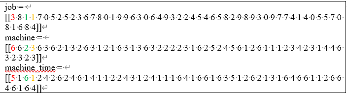

# NSGA2_Workshop_rescheduling

use NSGA2 to solve Workshop rescheduling

## 1 前置知识

## 1.1 编码

本文利用遗传算法来实现柔性车间调度问题，所使用的编码规则如下：



job中的数字代表第(数字+1)个订单，数字出现的次数代表订单的第几道工序，machine和machine对应的位置就是该订单该道工序的加工机器和加工时间。例如：

红字部分的3,6,5表示第4个订单的第1道工序(3第1次出现)用机器6加工，加工时间为5。

绿字部分的1,2,6表示第2个订单的第1道工序(1第1次出现)用机器2加工，加工时间为6。

橘字部分的1,3,1表示第2个订单的第2道工序(1第2次出现)用机器3加工，加工时间为1。

## 1.2 NSGA2遗传算法

# 2 代码说明

实现柔性车间调度和重调度的代码文件涉及5个，分别为main.py，data_solve.py，fjsp.py， nsga_2.py，multi_opt.py。

- 步骤1：初始化多个工序，机器，加工时间编码，解码得到加工时间、机器负荷和能耗
- 步骤2：进行交叉变异，根据加工时间、机器负荷和能耗，进行非支配排序和拥挤度的计算，淘汰一半个体
- 步骤3：判断是否达到最大迭代次数，是的话输出结果，否则转到步骤3

文件作用：

- main.py

  - 主执行文件
- data_solve.py

  - read_first()
    - 处理普通调度中“MK01.xlsx”的数据
  - read_Resheduling()
    - 处理重调度中“插入订单”，“第一次调度结果”，“MK01.xlsx”的数据
  - read()
    - 返回值：info,delivery_time, work
    - 将read_first()和read_Reshduling传入的数据提炼出机器数据字典info，交货时间delivery_time和初始工序编码work。
    - info的数据结构是字典
      {订单号:{工序:{可用机器:可用机器加工时间}}}

      - 示例如下：

      ```python
      {0: {0: {1: 5, 3: 4},
        1: {2: 1, 3: 5, 5: 3},
        2: {3: 4, 6: 2},
        3: {1: 1, 2: 6, 6: 6},
        4: {3: 1},
        5: {3: 6, 4: 3, 6: 6}},
       1: {0: {2: 6}, 1: {3: 1}, 2: {1: 2}, 3: {2: 6, 4: 6}, 4: {1: 1, 2: 6, 6: 5}},
       2: {0: {2: 6},
        1: {3: 4, 6: 2},
        2: {1: 1, 2: 6, 6: 5},
        3: {2: 6, 3: 4, 6: 6},
        4: {1: 1, 5: 5}},
       3: {0: {1: 1, 2: 6, 6: 5},
        1: {2: 6},
        2: {3: 1},
        3: {2: 1, 3: 5, 5: 3},
        4: {3: 4, 6: 2}},
       4: {0: {2: 1, 3: 5, 5: 3},
        1: {1: 1, 2: 6, 6: 5},
        2: {2: 6},
        3: {1: 5, 3: 4},
        4: {2: 6, 4: 6},
        5: {2: 6, 3: 4, 6: 6}},
       5: {0: {3: 4, 6: 2},
        1: {1: 2},
        2: {2: 6, 3: 4, 6: 6},
        3: {2: 6},
        4: {1: 1, 2: 6, 6: 5},
        5: {1: 3, 4: 2}},
       6: {0: {6: 1},
        1: {1: 3, 4: 2},
        2: {2: 6, 3: 4, 6: 6},
        3: {1: 6, 2: 6, 5: 1},
        4: {3: 1}},
       7: {0: {3: 4, 6: 2},
        1: {2: 6, 3: 4, 6: 6},
        2: {1: 1, 2: 6, 6: 5},
        3: {2: 6},
        4: {2: 6, 4: 6}},
       8: {0: {6: 1},
        1: {1: 1, 5: 5},
        2: {3: 6, 4: 3, 6: 6},
        3: {1: 2},
        4: {2: 6, 3: 4, 6: 6},
        5: {2: 6, 4: 6}},
       9: {0: {3: 4, 6: 2},
        1: {2: 6, 3: 4, 6: 6},
        2: {2: 1, 3: 5, 5: 3},
        3: {6: 1},
        4: {2: 6, 4: 6},
        5: {1: 3, 4: 2}}}

      ```
    - delivery_time是一维数组，且len(delivery_time)=订单数
    - work是一维数组，且len(work)=各订单工序之和

      - 示例

      ```python
      work = [0, 0, 0, 0, 0, 0, 1, 1,
      1, 1, 1, 2, 2, 2, 2, 2, 3, 3, 3, 3, 3, 4, 4, 4, 4, 4, 4, 5, 5, 5, 5, 5, 5, 6,
      6, 6, 6, 6, 7, 7, 7, 7, 7, 8, 8, 8, 8, 8, 8, 9, 9, 9, 9, 9, 9]
      ```
- fjsp.py

  - encoding()

    - 用于生成种群初始化时的初始编码
    - 返回值：job,machine,machine_time(三者的维度为1$\times$订单工序总数)
      - STEP1:将data_solver.py中生成的work随机打乱，得job = [[8 0 4 6 4 4 2 5 2 0 7 9 1 5 5 3 6 5 1 8 2 9 7 3 8 9 2 0 4 1 3 6 4 9 6 6 0 7 5 8 3 8 0 2 9 1 7 5 8 0 1 3 9 4 7]]
      - STEP2:遍历job(利用一个可变数组ccount记录下目前遍历的是第几个订单的第几个工序，ccount是一个一维数组，len(ccount)等于订单数)，设定[0,1]范围的选择随机数，如果随机数大于pi(人为设定的值，本文设定为0.5)，那么目前遍历到的订单的工序的所用机器为该订单该工序用时最小的机器(在info中查询)；如果随机数小于pi，那么目前遍历到的订单的工序的所用机器为该订单该工序可用机器的随机一台(在info中查询)，机器编号和机器用时分别存入machine，machine_time
  - decoding1()

    - 普通调度的解码函数
      - 对job,machine,machine_time的数据进行解码，得出每个订单的结束时间和每台机器的最晚完工时间，从而计算出订单最晚完工时间，时间成本，机器总负荷和能耗成本。
      - 函数变量说明：
        - 数组jobtime用于记录每一道工序的结束时间
        - 数组tmm用于记录每一台机器当前加工工序的结束时间，数组tmmw用于记录每一台机器工作时间总和（用于计算能耗），维度均为1$\times$各订单工序之和，数组初始化全为0
          1. 工序$O_{ij}$(第$i$个订单的第$j$道工序)在机器$M_h$开始加工时间：
             * 如果工序$O_{ij}$是第$i$个订单的第1道工序，同时也是机器$M_h$生产的第1道工序，那么工序$O_{ij}$在机器$M_h$的开始加工时间为0
             * 如果工序$O_{ij}$是第$i$个订单的第1道工序，但是不是机器$M_h$生产的第1道工序，那么工序$O_{ij}$在机器$M_h$的开始加工时间为机器$M_h$生产上一道工序的结束时间
             * 如果工序$O_{ij}$既不是第$i$个订单的第1道工序，也不是机器$M_h$生产的第1道工序，那么工序$O_{ij}$在机器$M_h$的开始加工时间为max(机器$M_h$生产上一道工序的结束时间，工序$O_{i,j-1}$的结束时间)
          2. 工序$O_{ij}$(第$i$个订单的第$j$道工序)在机器$M_h$结束加工时间=工序$O_{ij}$在机器$M_h$的开始加工时间+工序$O_{ij}$在机器$M_h$的加工时间
          3. 订单$i$的结束时间=订单$i$最后一道工序的结束时间
  - decoding2()

    - 重调度的解码函数

      - 对job,machine,machine_time的数据进行解码，得出重调度部分的每个订单的结束时间和每台机器的最晚完工时间，从而计算出重调度订单的最晚完工时间，重调度部分的机器总负荷和重调度部分的能耗成本。
      - 解码算法核心思想
        1. 重调度时刻后的订单工序将进行重新编号，比如订单1的工序5是重调度时刻后的第1道工序，那么工序5重新编号为工序1，其他工序类似。
        2. 工序$O_{ij}$(第$i$个订单的第$j$道工序)在机器$M_h$开始加工时间：
           * 如果订单$i$在重调度时刻有订单正在加工：
             * 如果工序$O_{ij}$是订单$i$重调度时刻后的第1道未加工工序，且是是机器$M_h$生产的第1道工序，那么工序$O_{ij}$的开始时间是正在加工工序自重调度时刻开始计算的结束时间
             * 如果工序$O_{ij}$是订单$i$的第1道工序，但是不是机器$M_h$生产的第1道工序，那么工序$O_{ij}$在机器$M_h$的开始加工时间为max(机器$M_h$生产上一道工序的结束时间，正在加工工序自重调度时刻开始计算的结束时间)
             * 如果工序$O_{ij}$既不是第$i$个订单的第1道工序，也不是机器$M_h$生产的第1道工序，那么工序$O_{ij}$在机器$M_h$的开始加工时间为max(机器$M_h$生产上一道工序的结束时间，工序$O_{i,j-1}$的结束时间)
           * 如果订单$i$在重调度时刻没有订单正在加工：
             * 如果工序$O_{ij}$是第$i$个订单的第1道工序，同时也是机器$M_h$生产的第1道工序，那么工序$O_{ij}$在机器$M_h$的开始加工时间为0
             * 如果工序$O_{ij}$是第$i$个订单的第1道工序，但是不是机器$M_h$生产的第1道工序，那么工序$O_{ij}$在机器$M_h$的开始加工时间为机器$M_h$生产上一道工序的结束时间
             * 如果工序$O_{ij}$既不是第$i$个订单的第1道工序，也不是机器$M_h$生产的第1道工序，那么工序$O_{ij}$在机器$M_h$的开始加工时间为max(机器$M_h$生产上一道工序的结束时间，工序$O_{i,j-1}$的结束时间)
        3. 工序$O_{ij}$(第$i$个订单的第$j$道工序)在机器$M_h$结束加工时间=工序$O_{ij}$在机器$M_h$的开始加工时间+工序$O_{ij}$在机器$M_h$的加工时间
        4. 订单$i$的结束时间=订单$i$最后一道工序的结束时间
  - get_result()

    - 将最终的调度结果输出为excel文件
  - draw()

    - 绘制调度结果的甘特图
- nsga_2.py

  - nsga_total()
    - nsga2算法的实现
  - cross_var()
    - 实现nsga2的交叉变异
  - job_cross()(可视化文件见 **1_**  **交叉与变异可视化.xlsx** )
    - 工序编码的染色体交叉，pox交叉
  - mac_cross(可视化文件见 **1_**  **交叉与变异可视化.xlsx** )
    - 机器编码的染色体交叉和变异，均匀交叉
- multi_opt.py

  - divide()
    - 通过支配集规则，将群落中的个体进行分层，较优解位于上层，较劣解位于下层。
  - dis()
    - 对分层后的个体进行拥挤度计算，并让个体由拥挤度从大到小排列。
